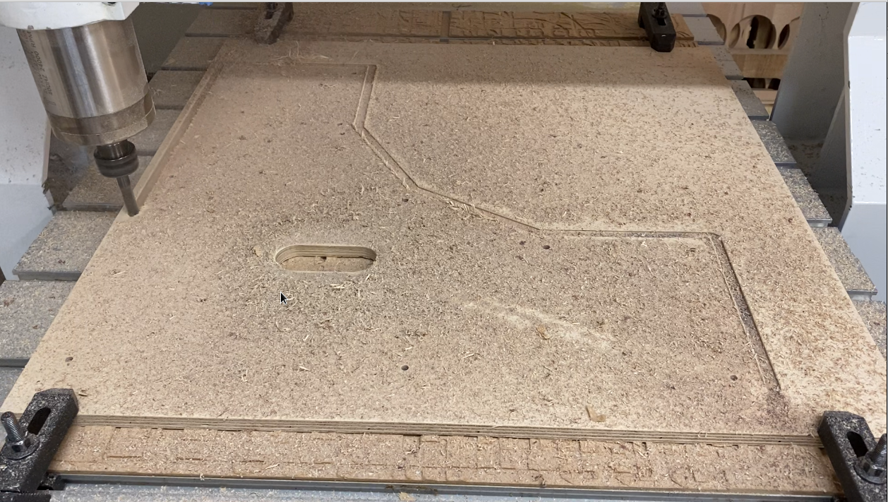
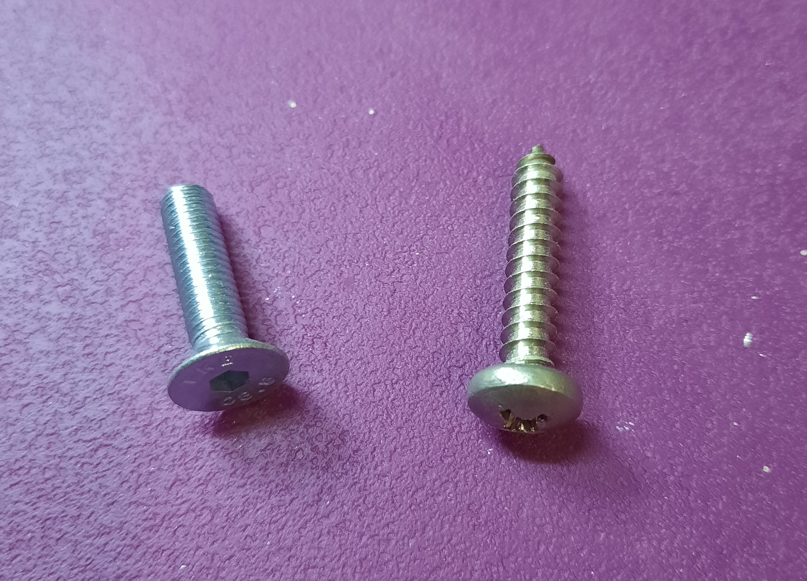

# Introduction

I started modular in 2008, with a doepfer A-100 G6 - 6U.

I'm the kind of person who needs to hold an object in my hands to fully understand how it's made and what components go into it.

Looking at it in detail, I realized that you could easily make your own box out of wood, whereas it's more difficult for an individual to make an aluminum one, as you need specific tools.

To begin with, you need to choose the format of the modules you want. Choosing a module format will determine the height of the row of modules. 

These links can help you find your way around the different formats:

* [Modwiggler](https://www.modwiggler.com/forum/viewtopic.php?t=9323)

* [SDIY](https://sdiy.info/wiki/Category:Module_formats)

Next, you need to choose the length of the rails (hence the length of the box) and build the box around them.

And then, of course, you need to size the power supply according to the number of modules, and distribute it to the modules...

These lengths are generally used, but anything is possible :)

84 hp = 427 mm // 104 hp = 529 mm // 110 hp = 559 mm // 126 hp = 640 mm // 168 hp = 854 mm

## Draw your rack

I drew my box with freecad: [Freecad](https://www.freecad.org/)

But it also works with a paper plan :)

You're free to design the box you want, but be careful if you want a particular shape. In this case, you'll have to use a CNC milling machine, as the angles are difficult to make with ordinary hand-held power tools.

Of course, it's much easier with a rectangle box :)

The native Freecad files are in the folder: Freecad Files

Here's a screenshot of the box I wanted to make.

## Plans

Dimensioned drawings are essential for cutting. If you give them to a carpenter, he'll need them too...

In our case, we used a CNC, but for a simpler shape, all you need is a circular saw or even a jigsaw, and why not a handsaw :)

It all depends on the final look you want to achieve ^^.

## Wood

I chose a 12 mm thick birch plywood panel, 61 cm wide and 122 cm long.

With hindsight, I find that 12 mm thick is a little too heavy, 10 mm would be more than sufficient.

It's also possible to experiment with even thinner wood to save weight, especially if the synthesizer is frequently moved...

## Cutting

Find a cnc ... in a fablab for example :)

Map of fablabs:  [Fablab](https://www.makery.info/labs-map/)

## Render

## Woodstain

## Render after woodstain

## Rails

* Rails purchased from:  but there are also many online suppliers. [clicksclocks](https://clicksclocks.de/)

* There are 2 different rail profiles, the newer ones (top) are shallower, but this has no effect.

## Assembling Rails

* The rails are easy to attach to the sides, as the CNC has drilled the holes in the right place :)

There are several types of screws used, depending on the brand of rail manufacturer.

The one on the left is countersunk, M5 x 20 with a hollow hexagon socket.

The other has a domed head with a pitch unknown to me, and length 25, which is probably a screw dedicated to aluminum...

Both work, the advantage of the countersunk head is that it doesn't protrude beyond the wooden side.

* The assembled rack, sorry the picture is a bit blurry

* You may notice that I've used rails with different module screwing systems.

One solution is a continuous nut/threaded insert M3 rail.

The other is M3 square nuts that are slid into the rail.

And I prefer threaded because it's laborious to find the nuts behind the modules, sometimes there are too many on one side, and you have to dismantle the modules to get them on the other side, etc. But that's just my opinion.

But that's just my opinion :)

## Assembling Cleats

Next, you'll need to cut the cleats that will ensure the rigidity of the cabinet, and while you're at it, they'll support the bottom plate with the power supply placed on top.

Their cross-section must be at least 20 x 20 mm to ensure rigidity.

## Tightening

Setting up modules to align everything before final tightening of rails and cleats

## Bottom plate

Bottom plate with power supply on top

In the computer power supply box is the 220V transformer.

In red is the power supply board, which supplies +/-12V (1A) and +/-15V (4A).

Eurorack power busses are those of David Haillant

The ones on a strip-pasted plate that I re-tinned to reinforce the tin track with a copper wire core, this is my +/-15V ditribution bus, yes I know it's roots ^^

## OPTIONAL

In white it's a separate power supply (otherwise it's batteries ...) which is used to have 2 ammeters one to measure the current in ± 12 and the other the ±15V.

Diagram: [pjmnc](http://pjmnc.free.fr/files/digitalAmmeterBUS.JPG)

## Power supply

Power supply from the rear

## Final rendering

I added a cap with a ribbon of leds to make it look nice :)

And I also took advantage of the laser engraver to put a Saturn on the front.

## Technicals details : Bus Board

Bus board from  [David Haillant](https://www.tindie.com/products/dhaillant/eurorack-power-bus-26/)

## Technicals details : Bus Connectors

Bus connector from  [Reichelt](https://www.reichelt.com/fr/fr/barrette-broche-din-41651-16p-wsl-16g-p22822.html?r=1)

## Technicals details : Module Power cable

Manufacture of power cables for Eurorack modules : [Tuto on youtube](https://www.youtube.com/watch?v=40oXq8tCrBA)

## Technicals details : Power cable Connectors

16-pin connector, but I also use 10-pin because some modules use this format.

Connector from [Reichelt](https://www.reichelt.com/fr/fr/connecteur-femelle-selon-la-norme-din-41651-16p-pfl-16-p14573.html?r=1)

## Technicals details : Tool for Connectors 

Tool from [Reichelt](https://www.reichelt.com/fr/fr/outil-d-emmanchement-pour-sub-d-et-pfl-mwz-214-p13300.html?r=1)

## Technicals details : Flat Cable

Tool from [Farnell](https://fr.farnell.com/3m/3365-16/cable-en-nappe-16-voies-au-metre/dp/297318)

## Other box designs

You can even make your own cardboard box [Musicradar](https://www.musicradar.com/tuition/tech/how-to-build-your-own-cardboard-eurorack-modular-case-625196)

Andrew from Non Linear Circuits even offers open-source plans for making your own cabinet using a laser cutter or CNC: [Thingiverse](https://www.thingiverse.com/nonlinearcircuits/designs)

